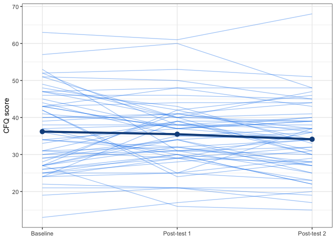

GMT data analysis: line graph example
================
Last updated: June 21, 2021

-   [CFQ](#cfq)
-   [Session info](#session-info)

``` r
library(readxl)
library(reshape2)
library(magrittr)
library(tidyverse)
```

    ## ── Attaching packages ─────────────────────────────────────── tidyverse 1.3.0 ──

    ## ✓ ggplot2 3.3.2     ✓ purrr   0.3.4
    ## ✓ tibble  3.0.4     ✓ dplyr   1.0.2
    ## ✓ tidyr   1.1.2     ✓ stringr 1.4.0
    ## ✓ readr   1.4.0     ✓ forcats 0.5.0

    ## ── Conflicts ────────────────────────────────────────── tidyverse_conflicts() ──
    ## x tidyr::extract()   masks magrittr::extract()
    ## x dplyr::filter()    masks stats::filter()
    ## x dplyr::lag()       masks stats::lag()
    ## x purrr::set_names() masks magrittr::set_names()

``` r
df = read_excel("../../data/iago/GMT_LineGraphs.xlsm") %>% 
  as.data.frame()
```

<!-- ======================================================================= -->

# CFQ

``` r
df.cfq = df %>% 
  select("Study_ID", "CFQ_Total_PreTest", "CFQ_Total_PostTest1", "CFQ_Total_PostTest2") %>% 
  melt(id = "Study_ID")

names(df.cfq) = c("id", "time", "cfq")

mean1 = df$CFQ_Total_PreTest %>% mean()
mean2 = df$CFQ_Total_PostTest1 %>% mean()
mean3 = df$CFQ_Total_PostTest2 %>% mean()
```

``` r
df.cfq %>% 
  ggplot(aes(x = time, y = cfq, group = id)) +
  geom_line(alpha = .4, colour = "dodgerblue2") +
  labs(x = NULL, y = "CFQ score") +
  stat_summary(group = 1, fun = mean, geom = "line",
               size = 1.5, colour = "dodgerblue4") + # line for mean
  stat_summary(group = 1, fun = mean, geom = "point",
               size = 3, colour = "dodgerblue4") + # points for mean
  scale_x_discrete(labels = c("CFQ_Total_PreTest" = "Baseline",
                              "CFQ_Total_PostTest1" = "Post-test 1",
                              "CFQ_Total_PostTest2" = "Post-test 2"),
                   expand = c(.05, .05)) + # adjust amount of white space on left and right
  theme_bw() # black and white theme 
```

<!-- -->

<!-- ======================================================================= -->

# Session info

``` r
sessionInfo()
```

    ## R version 4.0.5 (2021-03-31)
    ## Platform: x86_64-apple-darwin17.0 (64-bit)
    ## Running under: macOS Catalina 10.15.7
    ## 
    ## Matrix products: default
    ## BLAS:   /Library/Frameworks/R.framework/Versions/4.0/Resources/lib/libRblas.dylib
    ## LAPACK: /Library/Frameworks/R.framework/Versions/4.0/Resources/lib/libRlapack.dylib
    ## 
    ## locale:
    ## [1] en_CA.UTF-8/en_CA.UTF-8/en_CA.UTF-8/C/en_CA.UTF-8/en_CA.UTF-8
    ## 
    ## attached base packages:
    ## [1] stats     graphics  grDevices utils     datasets  methods   base     
    ## 
    ## other attached packages:
    ##  [1] forcats_0.5.0   stringr_1.4.0   dplyr_1.0.2     purrr_0.3.4    
    ##  [5] readr_1.4.0     tidyr_1.1.2     tibble_3.0.4    ggplot2_3.3.2  
    ##  [9] tidyverse_1.3.0 magrittr_1.5    reshape2_1.4.4  readxl_1.3.1   
    ## 
    ## loaded via a namespace (and not attached):
    ##  [1] tidyselect_1.1.0 xfun_0.19        haven_2.3.1      colorspace_1.4-1
    ##  [5] vctrs_0.3.4      generics_0.1.0   htmltools_0.5.0  yaml_2.2.1      
    ##  [9] rlang_0.4.8      pillar_1.4.6     glue_1.4.2       withr_2.3.0     
    ## [13] DBI_1.1.0        dbplyr_2.0.0     modelr_0.1.8     lifecycle_0.2.0 
    ## [17] plyr_1.8.6       munsell_0.5.0    gtable_0.3.0     cellranger_1.1.0
    ## [21] rvest_0.3.6      evaluate_0.14    labeling_0.4.2   knitr_1.30      
    ## [25] fansi_0.4.1      broom_0.7.2      Rcpp_1.0.5       scales_1.1.1    
    ## [29] backports_1.2.0  jsonlite_1.7.1   farver_2.0.3     fs_1.5.0        
    ## [33] hms_0.5.3        digest_0.6.27    stringi_1.5.3    grid_4.0.5      
    ## [37] cli_2.1.0        tools_4.0.5      crayon_1.3.4     pkgconfig_2.0.3 
    ## [41] ellipsis_0.3.1   xml2_1.3.2       reprex_0.3.0     lubridate_1.7.9 
    ## [45] assertthat_0.2.1 rmarkdown_2.5    httr_1.4.2       rstudioapi_0.11 
    ## [49] R6_2.5.0         compiler_4.0.5
